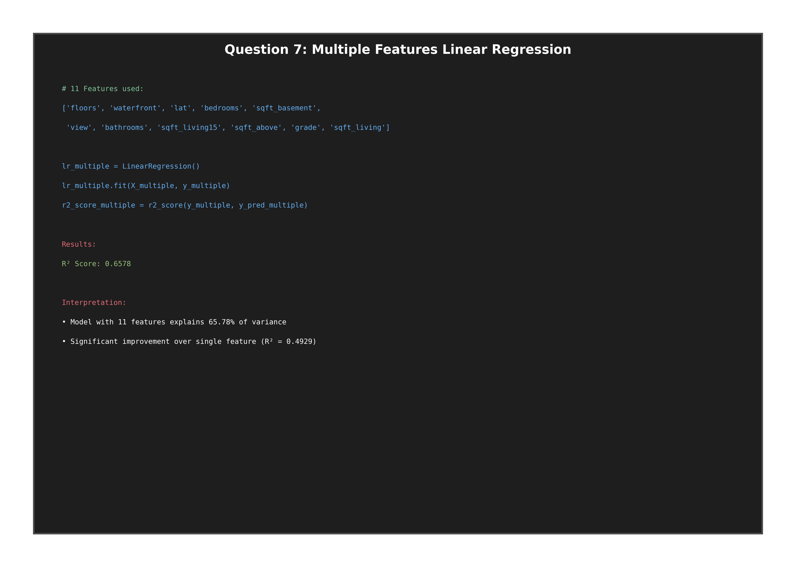
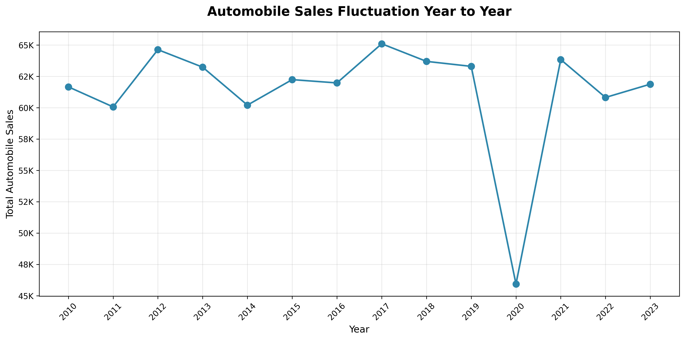
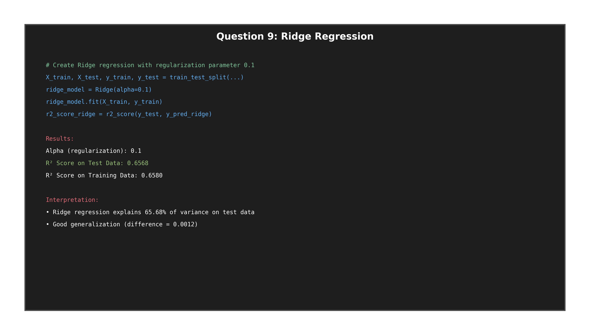
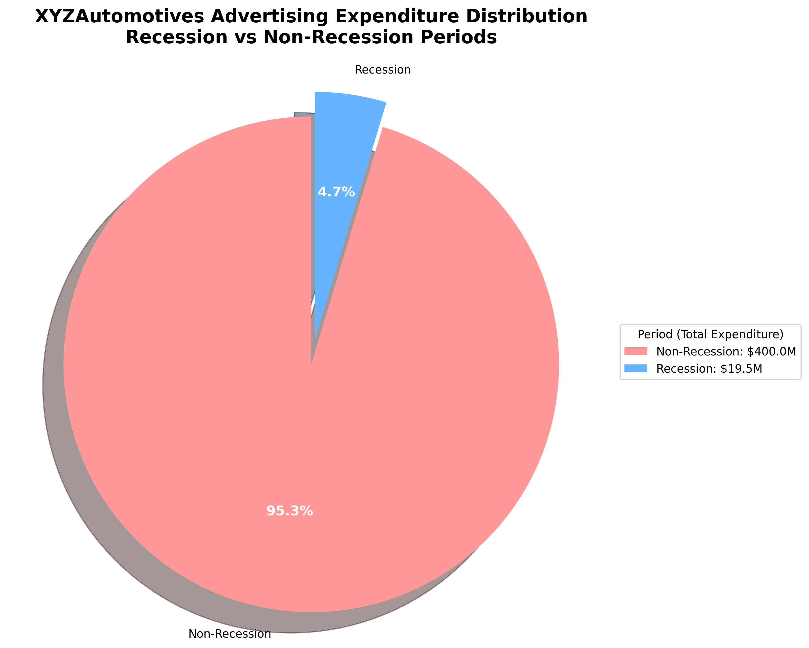

# Data Science Portfolio 🚀

Crafted collection of data science projects covering analysis, modeling, and interactive dashboards — cleanly organized and easy to explore.


— jump to — [Overview](#overview) • [Projects](#projects) • [Screenshots](#screenshots) • [Quickstart](#quickstart) • [Tech Stack](#tech-stack)

---

## Overview

This repository contains a curated set of assignments and mini-projects demonstrating:
- Feature engineering and statistical exploration
- Regression modeling with regularization and pipelines
- Plotly/Dash interactive visualizations
- Clean project structure and reproducible workflows

## Repository Structure

```
data-science/
├── assignments/           # All assignment notebooks organized by topic
│   ├── house_sales_analysis/     # King County house sales prediction
│   ├── automobile_sales_visualization/  # Automobile sales dashboard
│   └── spacex_data_analysis/     # SpaceX data wrangling project
├── data/                 # Datasets used in assignments
├── scripts/              # Python utility scripts for automation
├── outputs/              # Generated outputs and results
│   └── screenshots/      # Screenshot collections for assignments
└── README.md            # This file
```

## Projects

Each project includes a focused README and runnable notebook(s).

### House Sales Analysis (King County, USA)
Path: `assignments/house_sales_analysis/House_Sales_in_King_Count_USA.ipynb`

- Predicting home prices using linear and ridge regression with polynomial features
- EDA, feature importance, correlation heatmaps, and model evaluation (R²)
- Pipeline-based workflow with train/test splits

Highlights:
- R² (single feature `sqft_living`): ~0.49
- R² (multiple features, 11): ~0.66
- Regularized models to reduce overfitting

—

### Automobile Sales Visualization
Path: `assignments/automobile_sales_visualization/Automobile_Sales_Data_Visualization.ipynb`

- Plotly visualizations and a Dash app for exploring sales trends
- Year-wise insights, recession analysis, and category breakdowns
- Interactive controls (dropdowns) with dynamic callbacks

—

### SpaceX Data Analysis
Path: `assignments/spacex_data_analysis/spacex_data_wrangling_completed.ipynb`

- Practical data wrangling and EDA on SpaceX launch data
- Feature engineering and pattern discovery

## Screenshots

A peek at some outputs (more in `outputs/screenshots/`):

<div align="center">







</div>

## Tech Stack

- Data: pandas, numpy
- ML: scikit-learn (LinearRegression, Ridge, PolynomialFeatures, Pipeline)
- Viz: matplotlib, seaborn, plotly
- App: dash, plotly.graph_objects
- Dev: Jupyter, Python 3.13

### Environment Setup
```bash
# Create virtual environment
python3 -m venv .venv
source .venv/bin/activate  # On Windows: .venv\Scripts\activate

# Install dependencies
pip install pandas numpy scikit-learn matplotlib seaborn plotly dash jupyter
```

## Quickstart

Run any project notebook:

```bash
cd assignments/house_sales_analysis && jupyter notebook House_Sales_in_King_Count_USA.ipynb
```

```bash
cd assignments/automobile_sales_visualization && jupyter notebook Automobile_Sales_Data_Visualization.ipynb
```

## Dataset Information

### House Sales Dataset
- **File:** `data/kc_house_data_NaN.csv`
- **Records:** 21,613 house sales
- **Features:** 22 columns including price, bedrooms, bathrooms, sqft_living, etc.
- **Source:** King County public records

## Status

✅ **House Sales Analysis:** Complete (all 10 questions + additional analysis)
- All code cells executed successfully
- R² scores calculated for various models
- Comprehensive visualizations generated
- Screenshots captured for peer review

✅ **Automobile Sales Visualization:** Complete (Parts 1 & 2)
- Interactive dashboard implemented
- All visualization types created
- Screenshots generated

✅ **SpaceX Data Analysis:** Complete
- Data wrangling and preprocessing finished

## What You'll Learn

1. **Data Analysis:** Statistical analysis, correlation studies, feature selection
2. **Machine Learning:** Linear regression, regularization, model evaluation
3. **Visualization:** Creating effective plots for data storytelling
4. **Dashboard Development:** Interactive web applications with Dash
5. **Code Organization:** Jupyter notebook best practices and documentation

## Notes

All assignment screenshots are available in `outputs/screenshots/` for:
- Peer review submissions
- Portfolio demonstration
- Progress documentation

For questions or issues, please refer to the individual assignment README files in each folder.